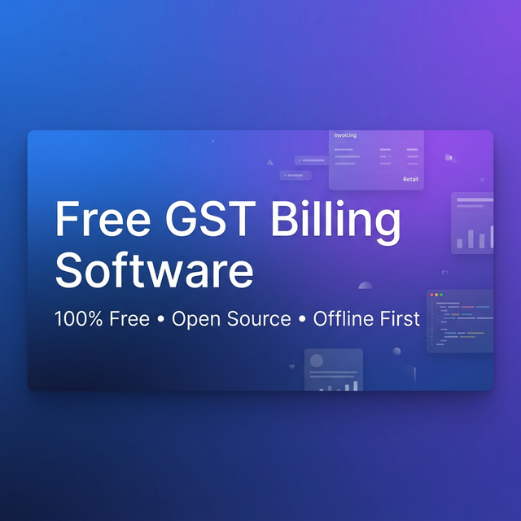

# FreeGSTBill

### Free, Open-Source GST Invoice & Billing Software

Create GST-compliant invoices for Indian and international clients. Runs 100% locally on your computer — no signup, no subscription, no cloud. Every invoice, client record, and report stays on YOUR machine. Nobody else can see your financial data. Ever.

**Built by [DiceCodes](mailto:Contact@dicecodes.com)**



---

## Why FreeGSTBill?

Most billing software stores your data on their servers, charges you monthly, and locks you in. FreeGSTBill is different:

- **Your data never leaves your computer** — Everything is stored as local JSON files in a `data/` folder on your machine. No cloud, no third-party servers, no analytics, no tracking. Your invoices, client details, GSTIN, bank info — all stays with you. Period.
- **GST compliance on autopilot** — Just create invoices normally. FreeGSTBill auto-generates your GSTR-1 (B2B + B2C), GSTR-3B summary, HSN reports, and Document Summary. When filing day comes, your data is ready — download CSVs, follow the built-in step-by-step filing guide, and you're done. No CA needed for basic filing.
- **Works without internet** — Once installed, the entire app runs on localhost. No internet required to create invoices, generate PDFs, or view reports. Only Google Drive backup (optional) needs connectivity.
- **Install once, use forever** — No monthly fees. No "free tier" limits. No premium upsell. MIT licensed. You own the software.
- **Install as a desktop app (PWA)** — Works like a native Windows/Mac app. One-click install from your browser. Opens instantly, no browser tabs needed.

---

## Key Highlights

- **100% Local & Private** — Runs on localhost. All data stored as files on your machine. Zero cloud dependency.
- **Multi-Currency** — Bill in INR, USD, EUR, GBP, AUD, CAD, SGD, AED with proper formatting and amount-in-words.
- **GST Compliant** — Auto CGST/SGST (intra-state) and IGST (inter-state) calculation.
- **GST Filing Ready** — GSTR-1, GSTR-3B summaries, HSN reports, CSV export, step-by-step filing guide. All compliance data auto-generated from your invoices.
- **Expense Tracker + ITC** — Track expenses with GST, auto-calculate Input Tax Credit, feeds into GSTR-3B and P&L.
- **Professional PDFs** — Download or auto-upload to Google Drive.
- **Dark Mode** — Full dark theme support.
- **Free Forever** — MIT licensed, no hidden costs.

---

## Who Is This For?

FreeGSTBill replaces paid billing software for anyone who sends invoices. If you're paying for Zoho, Tally, Vyapar, or any SaaS billing tool — you don't have to.

| Industry | How They Use It |
|----------|----------------|
| **Freelancers & Consultants** | Invoice clients for projects, retainers, hourly work. Bill international clients in USD/EUR/GBP. |
| **Software Developers & IT Services** | Bill for development, SaaS, AMC contracts. Export invoices for foreign clients. |
| **Graphic Designers & Creative Agencies** | Proforma estimates before work, tax invoices after delivery. |
| **CA / Accountants / Tax Consultants** | Generate invoices for advisory fees. Track client payments. Use GST filing guide. |
| **Tutors & Coaching Centres** | Monthly fee invoices with batch-wise billing. Recurring invoices for retainer students. |
| **Photographers & Videographers** | Quotation (proforma) + final invoice for events and shoots. |
| **Small Manufacturers & Traders** | GST tax invoices with HSN codes, bill of supply for exempt goods. |
| **Retailers & Shopkeepers** | Quick bill generation with UPI QR code for instant payment. |
| **Exporters** | Multi-currency invoices (USD, EUR, GBP, AED) with GST turned off for export. |
| **Doctors & Clinics** | Bill of supply for healthcare services (GST exempt). |
| **Interior Designers & Architects** | Detailed estimates with extra pages for scope of work, material lists. |
| **Event Planners & Caterers** | Proforma with itemized breakdown, credit notes for cancellations. |
| **Transport & Logistics** | Invoices with per-item HSN, integrated with e-way bill (coming soon). |
| **Real Estate & Construction** | Multi-page invoices with payment milestones and terms. |
| **NGOs & Trusts** | Receipt generation and bill of supply for exempt services. |

**Bottom line:** If you send invoices and don't want to pay monthly for billing software, FreeGSTBill is for you.

---

## All Features

### 5 Invoice Types
| Type | Use Case |
|------|----------|
| **Tax Invoice** | Standard GST invoice with CGST/SGST/IGST |
| **Proforma / Estimate** | Quotations for clients before confirmation |
| **Bill of Supply** | Exempt goods/services or composition dealers (no GST) |
| **Credit Note** | Returns, price adjustments, corrections |
| **Delivery Challan** | Goods transport, job work, supply on approval (no GST) |

### Invoicing
- Auto invoice numbers with fiscal year prefix — `INV/2025-26/0001`
- Line items with HSN/SAC code, quantity, rate, per-item discount & tax
- Auto GST — CGST+SGST for same state, IGST for different state
- **8 currencies** — INR, USD, EUR, GBP, AUD, CAD, SGD, AED
- Amount in words — Indian format (Crore, Lakh) for INR, international format (Million, Thousand) for foreign currencies
- UPI QR code on invoice (auto-generated from your UPI ID)
- Custom notes & remarks per invoice
- **Private internal notes** — add notes only you can see (not printed on PDF). Useful for "follow up on 20th", "referred by Ravi", etc.
- **Quotation → Invoice** — convert any Proforma/Estimate to Tax Invoice in one click
- **E-Way Bill JSON** — download NIC-format JSON for e-way bill portal upload (goods > ₹50,000)
- **Auto-save** — all invoice data auto-saves as you type. No more lost work
- Rich-text extra pages — paste formatted content (tables, lists, headings) that render as separate PDF pages with auto page numbering

### 15 Toggle Controls
Show or hide any section on the invoice:

> GST, State, GSTIN, Place of Supply, HSN Code, Discount, Bank Details, UPI QR, Logo, Signature, Terms & Conditions, Notes, Amount in Words, Due Date, Item Quantity

### PDF & Sharing
- High-quality multi-page PDF export
- **WhatsApp** — share invoice directly (desktop app or web, auto-detected)
- **Email** — one-click email with invoice summary
- **Mobile** — Web Share API attaches PDF to WhatsApp/any app
- **Google Drive** — auto-upload PDFs after download (optional)

### Dashboard & Analytics
- Search invoices by client name or number
- Filter by type, status, fiscal year, date range
- Stats — total revenue, tax collected, invoice count, outstanding
- **Payment tracking** — record partial payments with date, mode (Bank/UPI/Cash/Cheque/Card), and notes
- Status tracking — Unpaid, Partial, Paid, Overdue
- **Auto-overdue detection** — invoices past due date auto-marked as overdue
- **Overdue alert banner** — red banner at top showing count + total overdue amount
- **Days overdue** — each overdue row shows "12d overdue" etc.
- **Stock auto-restore** — deleting an invoice adds stock back to inventory

### Expense Tracker
- Record business expenses with category, vendor, invoice number
- **GST on expenses** — enter GST % to auto-calculate ITC (Input Tax Credit)
- Filter by category, fiscal year, search
- CSV export for expenses
- Feeds into GSTR-3B ITC and P&L reports

### GST Reports & Filing (Auto-Generated)
All compliance data is generated automatically from your invoices and expenses. No manual entry needed.

- **GSTR-1 B2B** — all invoices with client GSTIN, broken down by taxable amount, CGST, SGST, IGST
- **GSTR-1 B2C** — invoices without GSTIN, aggregated by tax rate
- **GSTR-3B Summary** — output tax, ITC from expenses, net tax payable — ready to copy into GST portal
- **HSN Summary** — grouped by HSN code with quantity, taxable value, and tax breakup
- **Document Summary** — invoice number ranges and counts (Table 13)
- **CSV Export** — download B2B, B2C, and HSN reports as `.csv` files ready for GST portal upload
- **NIL Return Detection** — auto-detects periods with no activity
- Filter by fiscal year or specific month

> **How it works:** Create invoices → FreeGSTBill auto-calculates all GST breakdowns → Go to Reports page → Download CSVs → Upload to GST portal. That's it. Your CA can use these reports directly.

### GST Filing Guide
- **Step-by-step instructions** for filing GSTR-1 on the GST portal
- **Step-by-step instructions** for filing GSTR-3B with tax payment
- **NIL return guide** — how to file when there's no activity
- Interactive checklist with progress tracking
- Tips, deadlines, and penalty information

### Profit & Loss Report
- Revenue vs expenses breakdown (excluding GST)
- Net profit/loss with margin percentage
- Monthly P&L breakdown
- Auto-calculated from invoices and expenses

### Recurring Invoices
- Create templates for retainer clients
- Set frequency — weekly, monthly, quarterly, yearly
- One-click invoice generation from template
- Auto-advance next due date
- Pause/resume recurring templates
- Due invoice alerts

### Receipt / Payment Voucher
- Generate payment receipts for clients
- Quick-select from unpaid invoices
- Amount in words (auto-generated)
- Print-ready receipt format
- Track receipt number sequence

### Client Management
- Save recurring clients — name, address, state, GSTIN
- Quick-select when creating invoices
- Client-wise ledger with outstanding amounts

### Product Catalog / Inventory
- Save products with name, HSN/SAC, rate, GST %, unit, stock quantity
- **Auto-search** — start typing in line items, matching products appear instantly
- Auto-fills HSN, rate, and tax % from catalog — no retyping

### Multi-Business Profiles
- Save multiple business profiles
- Switch between businesses with one click
- Each profile stores name, GSTIN, bank details, logo, signature

### Dark Mode
- Full dark theme with automatic persistence
- Toggle from sidebar — applies instantly

### Business Profile
- Business name, address, GSTIN, PAN
- Bank details — account number, IFSC, bank name
- UPI ID for QR code generation
- Logo & digital signature upload
- Reusable terms & conditions templates

### Data Safety — Everything Stays Local
- All data stored as plain JSON files in `data/` folder on your machine
- **No cloud, no database, no external server** — your GSTIN, bank details, client info never leave your computer
- **Export** — download all data as JSON backup (move to another PC anytime)
- **Import** — restore from backup on any machine
- Auto-save drafts — never lose work mid-invoice
- Data persists even if you uninstall — just keep the `data/` folder

---

## Before You Install — What You Should Know

| Question | Answer |
|----------|--------|
| **Where does my data go?** | Nowhere. It stays in a `data/` folder on your computer as plain JSON files. No server, no cloud, no database. |
| **Can anyone access my invoices?** | No. The app runs on `localhost` (your machine only). It's not accessible from the internet or other computers on your network. |
| **What happens if I uninstall?** | Your `data/` folder remains untouched. Reinstall anytime and everything is still there. You can also export a full JSON backup from Settings. |
| **Do I need internet?** | Only for the first install (`npm install`). After that, everything works offline — invoicing, PDF generation, reports, everything. |
| **Will it handle my GST compliance?** | Yes. Create invoices normally and FreeGSTBill auto-generates: GSTR-1 B2B & B2C reports, GSTR-3B summary with ITC from expenses, HSN summary, Document Summary (Table 13), and CSV exports ready for the GST portal. It even has a step-by-step filing guide. |
| **Is it really free?** | Yes. MIT licensed. No premium tier, no ads, no tracking, no signup wall. Fork it, modify it, use it commercially — no restrictions. |

---

## Quick Start

**Requires:** [Node.js](https://nodejs.org/) v18+

```bash
git clone https://github.com/IamRamgarhia/freegstbill.git
cd freegstbill
npm install

# Windows
npm run dev:win

# macOS / Linux
npm run dev
```

Opens at **http://localhost:5173** — API server runs on port 3001.

### First-Time Setup
1. **Settings** → fill business profile (name, GSTIN, PAN, bank details)
2. Upload logo & signature (optional)
3. Add terms templates you reuse
4. **New Invoice** → start billing
5. Create a few invoices → go to **Reports** → see your GSTR-1, GSTR-3B, HSN data auto-generated

### Production
```bash
npm run build && npm start
```
Serves from port 3001.

### Install as Desktop App (PWA)

FreeGSTBill can be installed as a standalone desktop app — no browser tab needed.

**How to install:**
1. Open `http://localhost:5173` (dev) or `http://localhost:3001` (production) in **Chrome** or **Edge**
2. Look for the **install icon** (⊕) in the address bar (right side)
3. Click it → **Install**
4. The app opens in its own window — works like a native desktop app

**How to verify PWA is working:**
1. After installing, close the browser completely
2. Open the app from your Start Menu / Desktop shortcut
3. It should open in its own window (no browser UI)
4. Disconnect from internet → create an invoice → generate PDF — everything should work
5. Check Chrome DevTools → Application → Service Workers → should show "activated and running"

**To uninstall:** Right-click the app title bar → "Uninstall FreeGSTBill", or go to `chrome://apps` and remove it.

> **Note:** The PWA caches all frontend assets. The backend server (`node server.js`) still needs to be running for data to save. For a fully portable setup, use the provided `.bat` / `.vbs` launchers on Windows.

---

## Tech Stack

| | Technology |
|---|-----------|
| Frontend | React 19, Vite 7 |
| Backend | Express 5 (Node.js) |
| PDF | jsPDF + html2canvas |
| Icons | Lucide React |
| QR | qrcode |
| Storage | Local JSON files — no database |

---

## Google Drive Setup (Optional)

1. [Google Cloud Console](https://console.cloud.google.com/) → create project
2. Enable **Google Drive API**
3. **Credentials** → OAuth 2.0 Client ID → Web application
4. Add origin: `http://localhost:5173`
5. Copy Client ID → paste in **Settings** → Save
6. Click **Connect Google Drive** → authorize

PDFs auto-upload after every download.

---

## Project Structure

```
freegstbill/
├── server.js                     # Express API (port 3001)
├── src/
│   ├── App.jsx                   # Root + sidebar navigation + dark mode
│   ├── store.js                  # API client
│   ├── utils.js                  # Currency, number-to-words, GST helpers
│   ├── components/
│   │   ├── Dashboard.jsx         # Invoice list, filters, stats, payments
│   │   ├── InvoiceGenerator.jsx  # Create/edit with live preview
│   │   ├── InvoicePreview.jsx    # Invoice template
│   │   ├── ClientsView.jsx       # Client ledger
│   │   ├── InventoryView.jsx     # Product catalog management
│   │   ├── ExpenseTracker.jsx    # Business expense tracking
│   │   ├── RecurringInvoices.jsx # Recurring invoice templates
│   │   ├── ReceiptVoucher.jsx    # Payment receipt generation
│   │   ├── ReportsView.jsx       # GST reports + GSTR-3B + P&L
│   │   ├── GSTFilingGuide.jsx    # Step-by-step GST filing instructions
│   │   ├── SettingsView.jsx      # Profile, templates, multi-business, data backup
│   │   └── Toast.jsx             # Notifications
│   └── services/
│       └── googleDrive.js        # Drive OAuth & upload
└── data/                         # Local storage (gitignored)
```

---

## API Reference

| Method | Endpoint | Description |
|--------|----------|-------------|
| GET/POST | `/api/bills` | List or create invoices |
| DELETE | `/api/bills/:id` | Delete invoice |
| GET/POST | `/api/clients` | List or save clients |
| DELETE | `/api/clients/:id` | Delete client |
| GET/POST | `/api/templates` | List or save terms templates |
| DELETE | `/api/templates/:id` | Delete template |
| GET/POST | `/api/products` | List or save products |
| DELETE | `/api/products/:id` | Delete product |
| GET/POST | `/api/expenses` | List or save expenses |
| DELETE | `/api/expenses/:id` | Delete expense |
| GET/POST | `/api/recurring` | List or save recurring templates |
| DELETE | `/api/recurring/:id` | Delete recurring template |
| GET/POST | `/api/receipts` | List or save receipts |
| DELETE | `/api/receipts/:id` | Delete receipt |
| GET/POST | `/api/profiles` | List or save business profiles |
| DELETE | `/api/profiles/:id` | Delete business profile |
| GET/POST | `/api/profile` | Get or update active business profile |
| GET/POST | `/api/meta/:key` | Metadata (invoice counters) |
| GET | `/api/export` | Full data backup (JSON) |
| POST | `/api/import` | Restore from backup |

---

## Roadmap

### Shipped
- [x] **Product Catalog / Inventory** — save products with HSN, rate, tax %. Auto-fill when creating invoices.
- [x] **GST Reports** — GSTR-1 (B2B + B2C), HSN Summary with CSV export for CA filing.
- [x] **Expense Tracker** — track business expenses with GST for ITC claims.
- [x] **GST Filing Assistant** — GSTR-1, GSTR-3B summary, Document Summary, NIL return detection.
- [x] **GST Filing Guide** — step-by-step instructions for filing on GST portal.
- [x] **Profit & Loss Report** — revenue vs expenses with monthly breakdown.
- [x] **Recurring Invoices** — auto-generate monthly/weekly invoices for retainer clients.
- [x] **Receipt / Payment Voucher** — generate payment receipts for clients.
- [x] **Multi-Business Profiles** — switch between multiple business profiles.
- [x] **Dark Mode** — full dark theme support.
- [x] **Delivery Challan** — document type for goods transport, job work, supply on approval.
- [x] **E-Way Bill JSON** — download NIC-format JSON for instant e-way bill portal upload.
- [x] **Quotation → Invoice** — one-click conversion from Proforma/Estimate to Tax Invoice.
- [x] **Auto-Save** — invoices auto-save to server as you type. No Save button needed.
- [x] **Private Internal Notes** — add notes only you can see (not on PDF).
- [x] **Auto Overdue Detection** — past-due invoices auto-marked with days overdue shown.
- [x] **Stock Auto-Deduction** — stock reduces on invoice creation, restores on deletion.
- [x] **Invoice Number Customization** — branded prefix, separator, financial year, digit padding.
- [x] **PWA / Installable** — install as desktop app via Chrome/Edge. Works offline.
- [x] **XSS Protection** — DOMPurify sanitization on all user-generated HTML content.

### Planned
- [ ] **Invoice Reminders** — auto email/WhatsApp reminders before due date
- [ ] **E-Invoice / IRN** — generate IRN via GST portal API (NIC e-invoice)
- [ ] **Multi-Language** — Hindi, Tamil, Marathi, Gujarati invoice support
- [ ] **Digital Signature** — DSC integration for signed invoices
- [ ] **Client Portal** — shareable link for clients to view & pay invoices
- [ ] **Aging Report** — 30/60/90 day outstanding analysis per client

Want a feature? Open an [issue](https://github.com/IamRamgarhia/freegstbill/issues) or email us.

---

## FAQ

**Is this really free?**
Yes. MIT licensed. No premium tier, no ads, no tracking.

**Where is my data stored?**
In a `data/` folder on your machine as JSON files. Nothing goes to any server.

**Can I bill international clients?**
Yes. Select any of the 8 supported currencies (USD, EUR, GBP, AUD, CAD, SGD, AED). Amount in words, formatting, and currency symbols adjust automatically. Turn off GST toggles for export invoices.

**Does it work offline?**
Yes. Only Google Drive upload needs internet.

**How do I file my GST returns?**
Go to the GST Filing Guide page in FreeGSTBill. It provides step-by-step instructions for filing GSTR-1 and GSTR-3B. Use the Reports page to get all the numbers you need.

**Can I track expenses and see profit/loss?**
Yes. Use the Expenses page to record business expenses. The Reports page auto-generates a P&L statement from your invoices and expenses.

**How do I backup or move to another PC?**
Settings → Export Data → save JSON file. On new PC → Settings → Import Data.

**Can I manage multiple businesses?**
Yes. Save your current profile as a business profile in Settings. Switch between profiles anytime.

**Can I customize the invoice design?**
Yes. The template is in `src/components/InvoicePreview.jsx` and `src/index.css`. Fork and modify.

---

## Contact & Support

- **Email:** [Contact@dicecodes.com](mailto:Contact@dicecodes.com)
- **Issues:** [GitHub Issues](https://github.com/IamRamgarhia/freegstbill/issues)
- **Feature Requests:** Open an issue or email us

---

## Contributing

We welcome contributions! Report bugs, suggest features, or submit pull requests.

---

## License

[MIT](LICENSE)

---

**FreeGSTBill** by [DiceCodes](mailto:Contact@dicecodes.com) — Free billing software. Made in India.
